<!DOCTYPE html>
<html lang="en">
<head>
<meta charset="UTF-8">
<meta name="viewport" content="width=device-width, initial-scale=1.0">
<title>Hasnain Ali — Flutter Developer</title>
<link rel="preconnect" href="https://fonts.googleapis.com">
<link href="https://fonts.googleapis.com/css2?family=Clash+Display:wght@400;500;600;700&family=Cabinet+Grotesk:wght@300;400;500;700&display=swap" rel="stylesheet">

</head>
<body>

<!-- NAV -->
<nav>
  <a href="#" class="logo">Hasnain.</a>
  <ul class="nav-center">
    <li><a href="#projects">Work</a></li>
    <li><a href="#about">About</a></li>
    <li><a href="#contact">Contact</a></li>
  </ul>
  <a href="#contact" class="nav-btn">Hire me</a>
</nav>

<!-- HERO -->
<header class="hero">
  
Flutter Developer · AI Specialist

  <h1>Building mobile apps clients love.</h1>
  
I craft intelligent Flutter apps — beautiful UI, seamless performance, and AI that actually works.

  

    <a href="#projects" class="btn-dark">See my apps</a>
    <a href="#contact" class="btn-outline">Let's talk</a>
  

</header>

<!-- PROJECTS -->
<section id="projects">
  

    

      Selected work
      7 projects
    

    <!-- 01 REVISABLE -->
    

      

        
01 — Education · AI

        <h2>Revisable</h2>
        
AI-powered study app for medical and finance students. Generates practice tests, flashcards, and study material — with ChatGPT for instant doubt-solving.

        

          MBBSNEET
          USMLECA · CFA
          ChatGPT
        

        
          View all screenshots
          <svg viewBox="0 0 16 16" fill="none" stroke="currentColor" stroke-width="2.5"><path d="M3 8h10M9 4l4 4-4 4"/></svg>
        
      

      

        
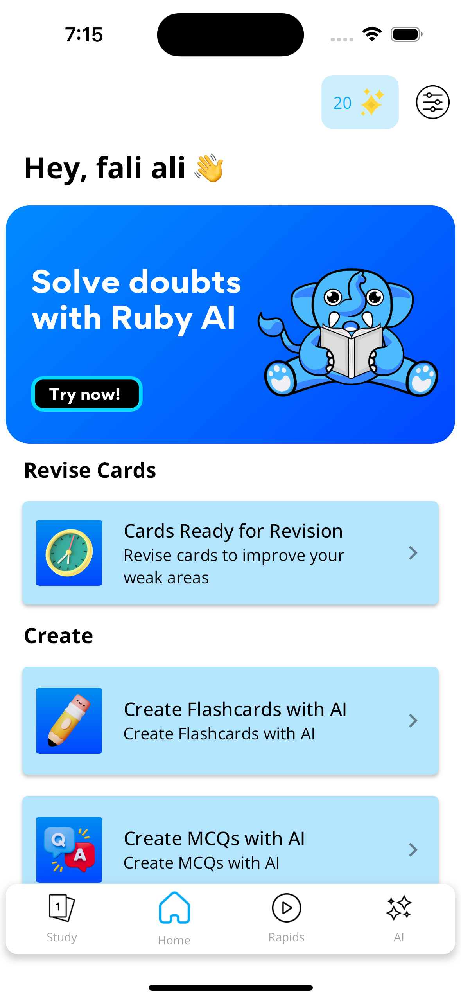

        
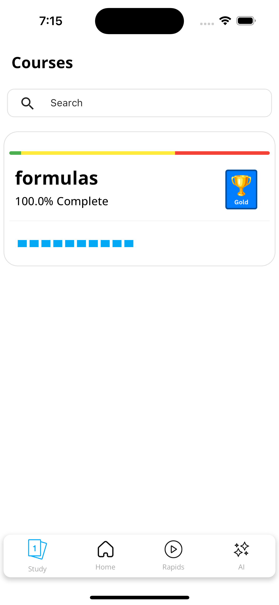

        
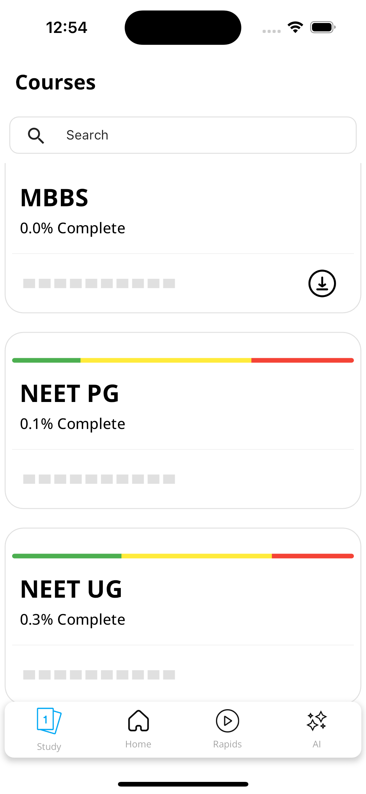

        
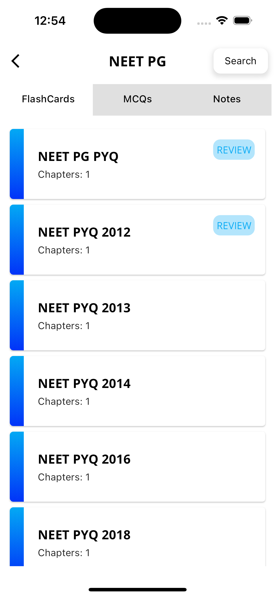

        
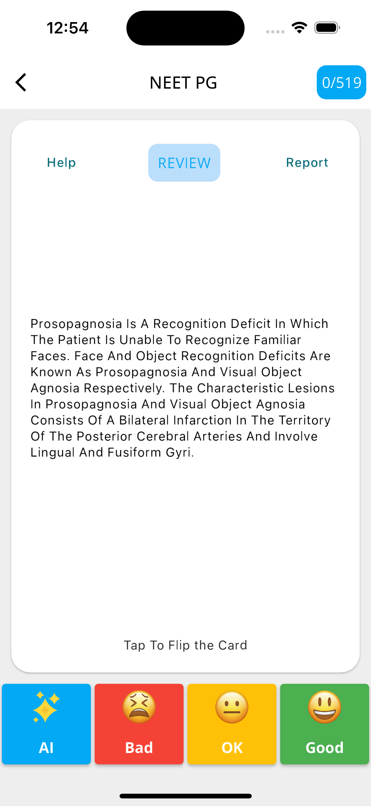

      

    

    <!-- 02 DOUBT CLEAR AI -->
    

      

        
02 — AI · Learning

        <h2>Doubt Clear AI</h2>
        
Snap a photo of any question and get expert-level answers instantly — 24/7, in any language, for any subject.

        

          Snap &amp; SolveMultilingual
          MathScience
        

        
          View all screenshots
          <svg viewBox="0 0 16 16" fill="none" stroke="currentColor" stroke-width="2.5"><path d="M3 8h10M9 4l4 4-4 4"/></svg>
        
      

      

        
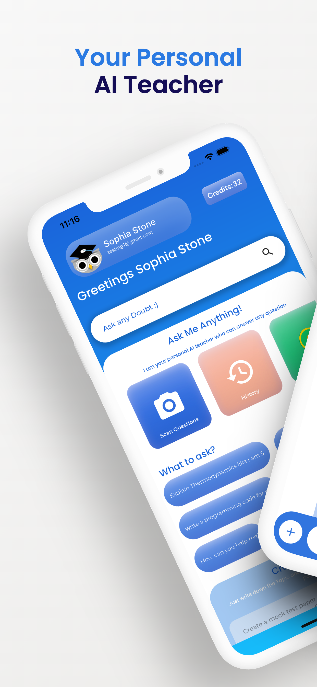

        
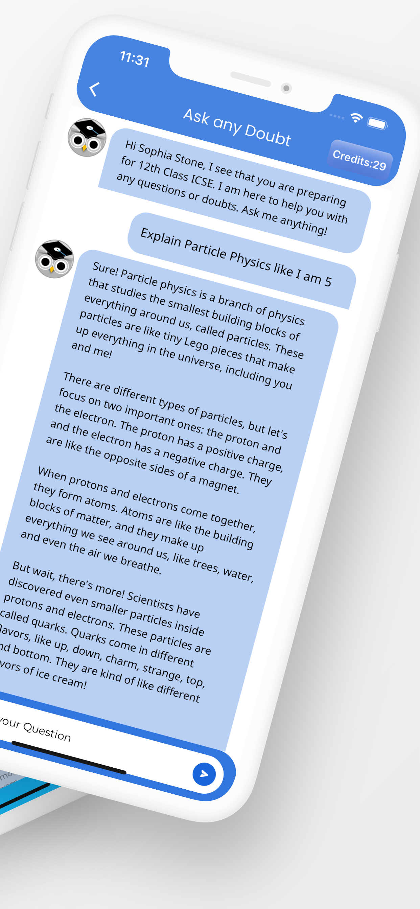

        
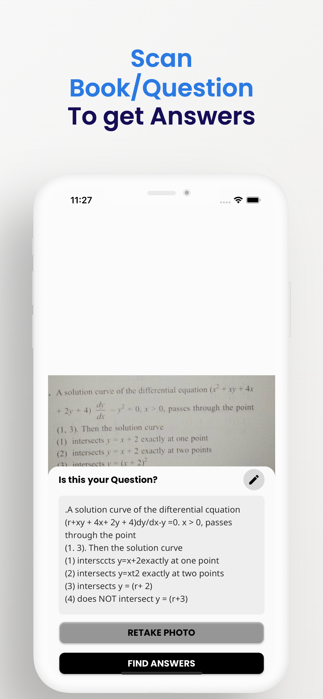

        
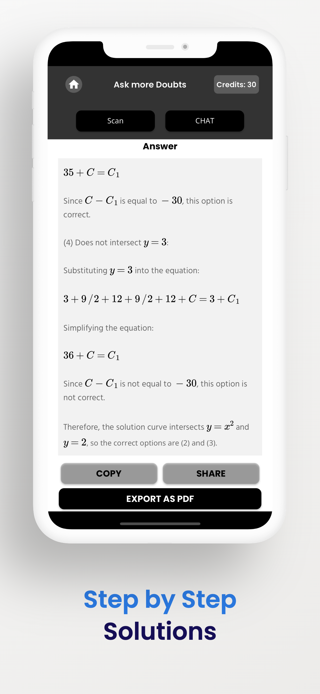

      

    

    <!-- 03 SCRIPTBAE -->
    

      

        
03 — Creative · Writing

        <h2>ScriptBae</h2>
        
AI writing assistant for content creators. Smart plot suggestions, dialogue tools, and real-time collaboration for TV, film, and e-learning.

        

          AI WritingCollaboration
          TV &amp; Film
        

        
          View all screenshots
          <svg viewBox="0 0 16 16" fill="none" stroke="currentColor" stroke-width="2.5"><path d="M3 8h10M9 4l4 4-4 4"/></svg>
        
      

      

        
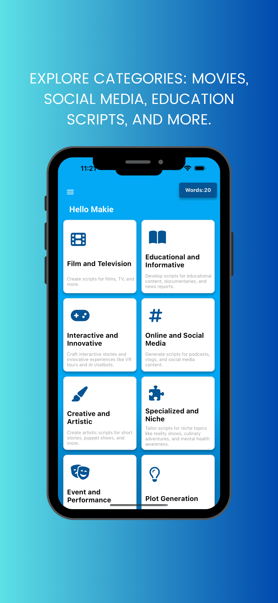

        
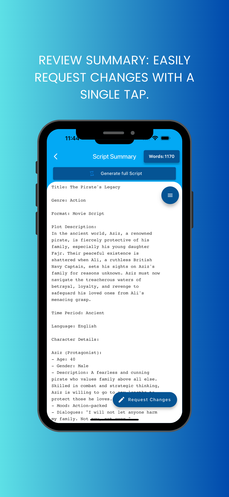

        
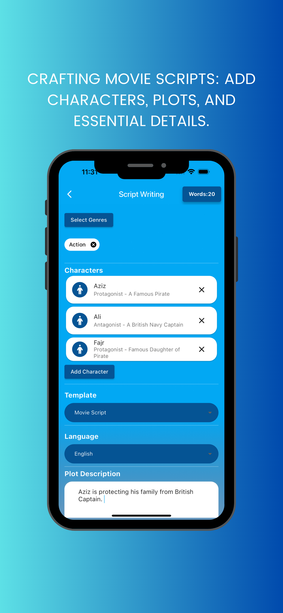

        
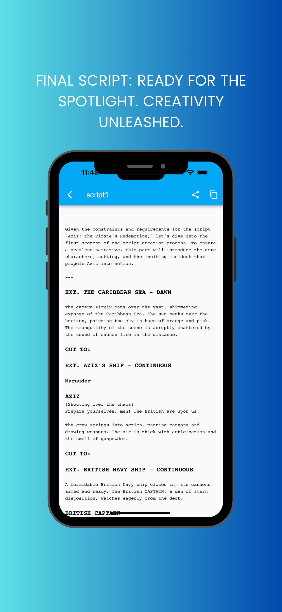

      

    

    <!-- 04 REMOTETAL -->
    

      

        
04 — Recruitment · Remote

        <h2>RemoteTal</h2>
        
Global talent marketplace — connecting companies with verified remote professionals, streamlined hiring, secure payments, and budget-friendly recruitment.

        

          RecruitmentRemote
          HiringPayments
        

        
          View all screenshots
          <svg viewBox="0 0 16 16" fill="none" stroke="currentColor" stroke-width="2.5"><path d="M3 8h10M9 4l4 4-4 4"/></svg>
        
      

      

        
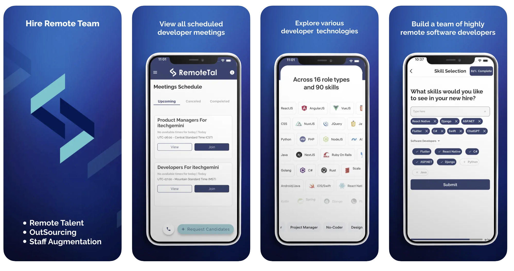

        
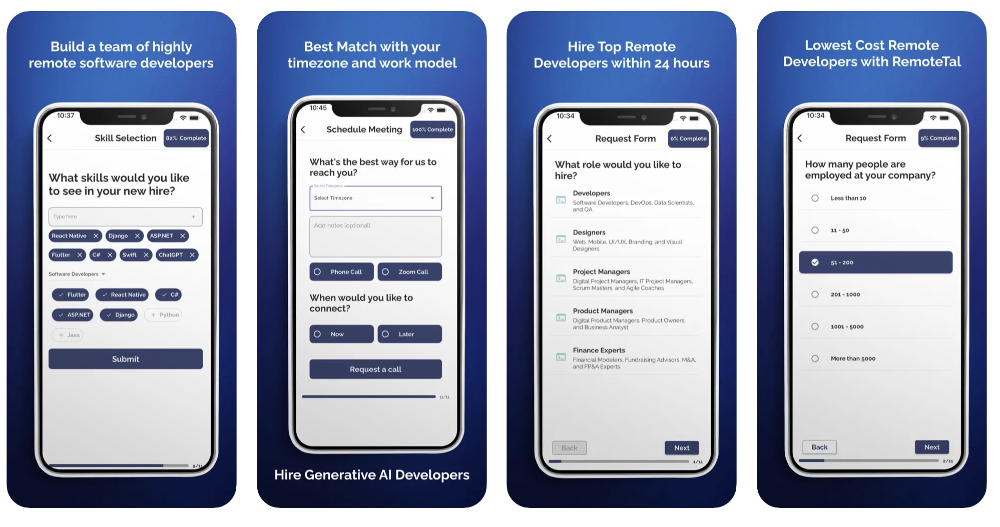

      

    

    <!-- 05 CODEAI -->
    

      

        
05 — Dev Tool · AI

        <h2>CodeAI</h2>
        
Virtual coding assistant — turns natural language into code, debugs errors, and teaches programming on demand. For beginners and professionals alike.

        

          Dev ToolAI
          Code GenerationDebugging
        

        
          View all screenshots
          <svg viewBox="0 0 16 16" fill="none" stroke="currentColor" stroke-width="2.5"><path d="M3 8h10M9 4l4 4-4 4"/></svg>
        
      

      

        
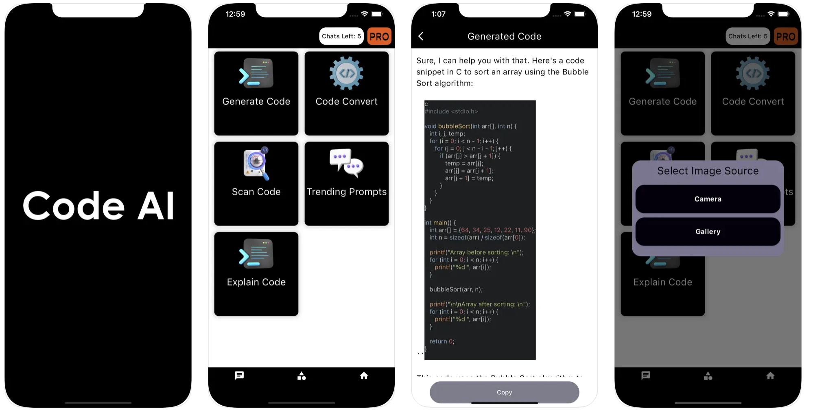

        
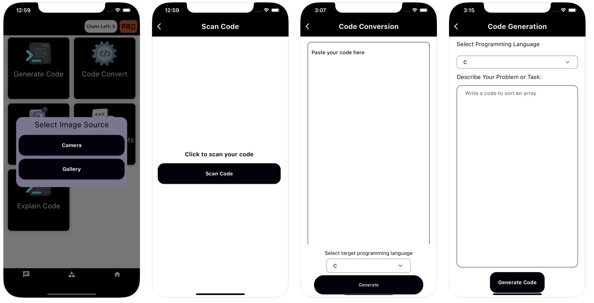

      

    

    <!-- 06 PIZZAGPT -->
    

      

        
06 — AI Chat · Free

        <h2>PizzaGPT</h2>
        
Multi-purpose AI chatbot for personalized recommendations and on-demand help — available 24/7 at no cost. Real-time conversations tailored to your needs.

        

          AI ChatFree
          24/7Recommendations
        

        
          View all screenshots
          <svg viewBox="0 0 16 16" fill="none" stroke="currentColor" stroke-width="2.5"><path d="M3 8h10M9 4l4 4-4 4"/></svg>
        
      

      

        
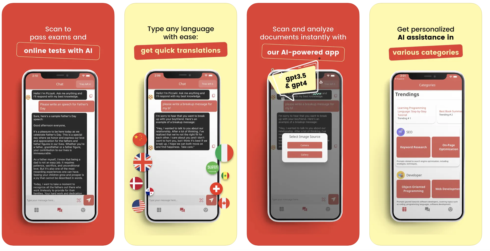

        
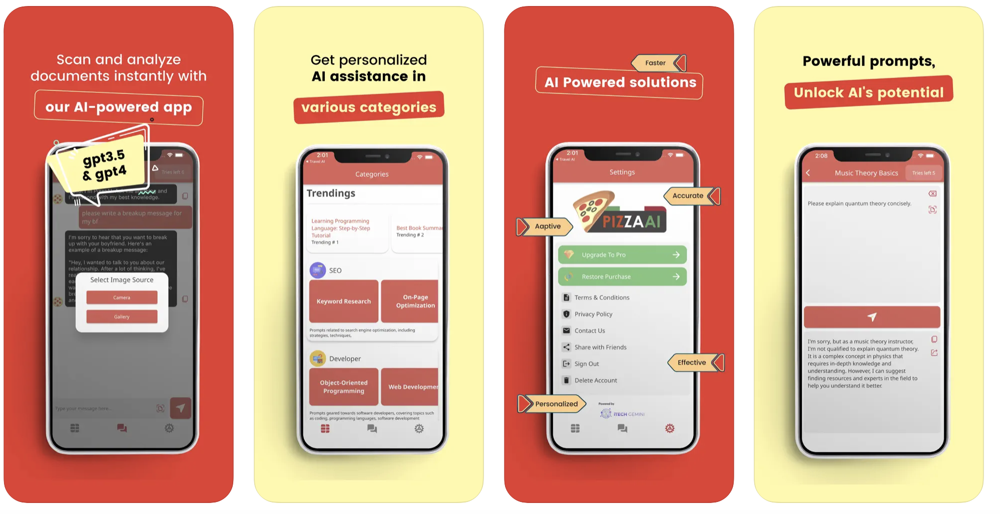

      

    

    <!-- 07 SPEECH AI -->
    

      

        
07 — Voice AI · Multilingual

        <h2>Speech AI</h2>
        
Natural voice interaction for language learning and on-demand AI knowledge — communicate in any language, anytime, with a friendly AI companion.

        

          Voice AIMultilingual
          SpeechLanguage Learning
        

        
          View all screenshots
          <svg viewBox="0 0 16 16" fill="none" stroke="currentColor" stroke-width="2.5"><path d="M3 8h10M9 4l4 4-4 4"/></svg>
        
      

      

        
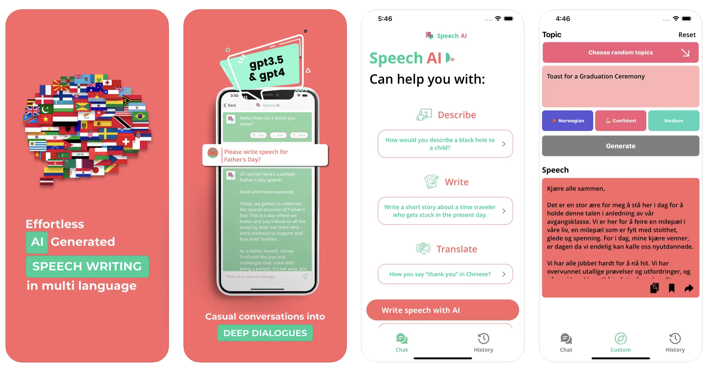

        
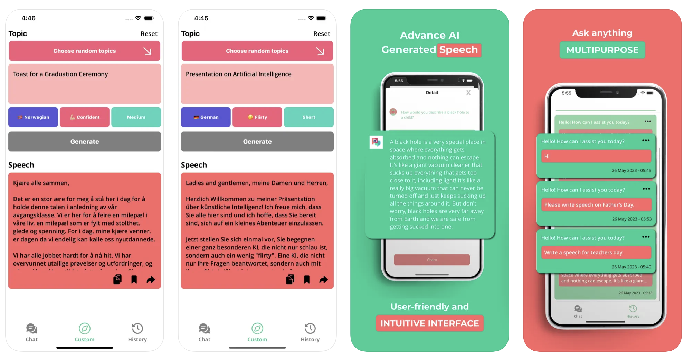

      

    

  

</section>

<!-- ABOUT -->
<section id="about">
  

    
About

    

      

        <h2>Hasnain Ali. Flutter developer &amp; AI builder.</h2>
        
I'm a passionate Flutter developer specializing in intelligent mobile applications that blend innovative design with cutting-edge AI and machine learning technologies.

        
Every project starts with understanding what users actually need — then I execute with clean architecture, beautiful UI, and meaningful features that solve real problems.

        

          Flutter
          Dart
          AI Integration
          ChatGPT API
          Firebase
          REST APIs
          UI/UX Design
          State Management
          Clean Architecture
          App Store Optimization
        

      

      

        
01
<h4>Mobile App Development</h4>
Production-ready Flutter apps for iOS and Android — clean code, great performance, zero compromise.

        
02
<h4>AI &amp; ML Integration</h4>
Embedding ChatGPT, vision models, and ML directly into mobile apps with seamless user experiences.

        
03
<h4>EdTech Solutions</h4>
Specialized in education apps — flashcards, test engines, video courses, and AI tutoring.

        
04
<h4>UI/UX Craftsmanship</h4>
Pixel-perfect Flutter interfaces that feel native, intuitive, and genuinely delightful to use.

      

    

  

</section>

<!-- CONTACT -->
<section id="contact">
  

    

      <h2>Let's build something great together.</h2>
      
Open to freelance, full-time, and collaboration opportunities.

      

        <a href="mailto:malikshanilhr09@gmail.com" class="btn-w">Send an email</a>
        <a href="https://itechgemini.com/" class="btn-g" target="_blank" rel="noopener">iTech Gemini</a>
        <a href="https://www.visionarchitech.com/" class="btn-g" target="_blank" rel="noopener">Vision Architech</a>
      

    

  

</section>

<!-- FOOTER -->
<footer>
  © 2025 Hasnain Ali
  

    <a href="https://itechgemini.com/" target="_blank" rel="noopener">iTech Gemini</a>
    <a href="https://www.visionarchitech.com/" target="_blank" rel="noopener">Vision Architech</a>
  

</footer>

<!-- LIGHTBOX -->

  

    <button class="lightbox-close" onclick="closeLightDirect()">✕</button>
    

    

    

    <a href="#" class="lightbox-visit" id="lb-link" target="_blank" rel="noopener">Visit Website</a>
  

</body>
</html>
