# Hasnain Ali's App Portfolio

## Introduction

Welcome to my portfolio! I’m Hasnain Ali, a passionate Flutter developer specializing in intelligent mobile applications that blend innovative design with cutting-edge AI and machine learning technologies. Explore some of my top-tier projects that demonstrate my expertise and creativity.

---

### Revisable App  
**[Revisable](https://www.revisable.in/)**

**Overview:**  
Revisable is a groundbreaking educational app designed for medical and finance students. It harnesses the power of AI to revolutionize how students study, revise, and prepare for competitive exams.

**Key Features:**
- **AI Study Tools:** Instantly create study materials, generate practice tests, and solve past papers.
- **Custom Flashcards:** Personalized flashcards for smarter and faster learning.
- **Test Series & Videos:** Deep revision resources including test series and lectures.
- **ChatGPT Integration:** Smart AI-based interaction for doubt-solving and learning enhancement.
- **Dedicated Courses:** Tailored for MBBS, NEET, USMLE, PLAB, CA, CFA, and more.
- **Ongoing Updates:** Regularly expanding course library.

**Screenshots:**  

  
  
  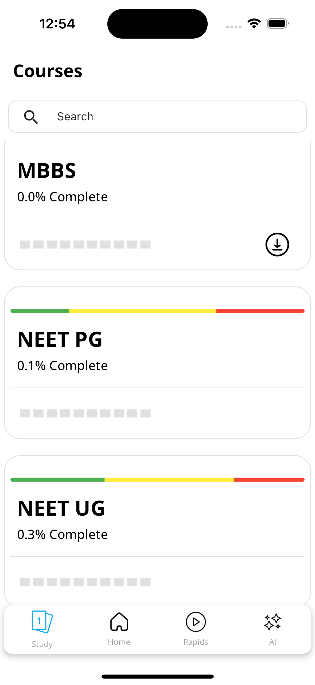
  
  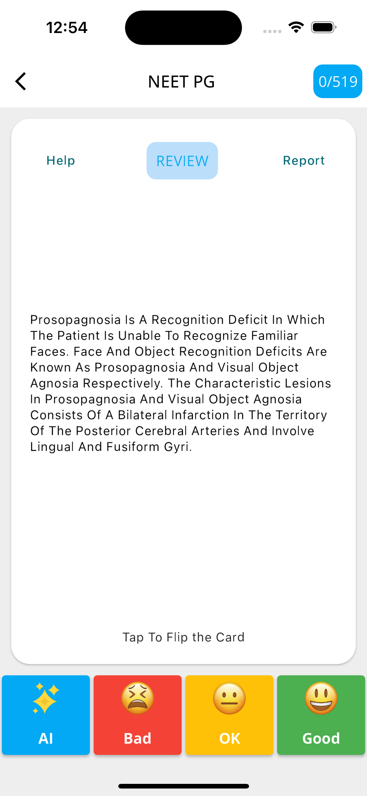
  
  
  
  
  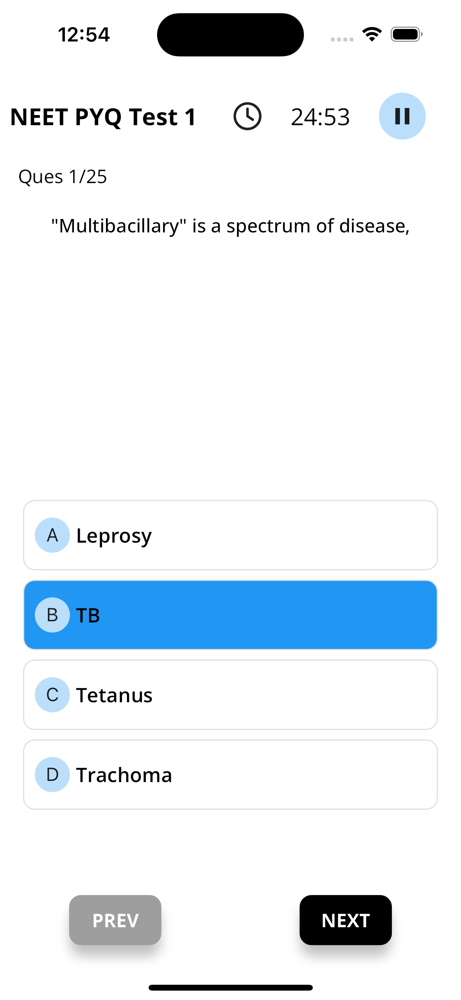
  
  
  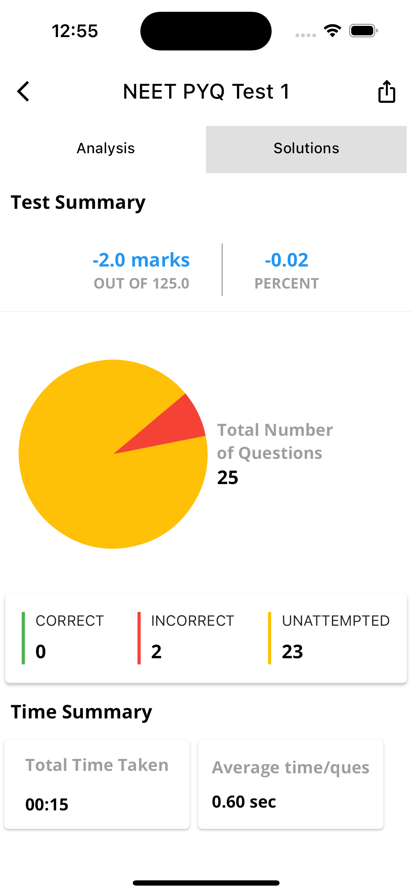
  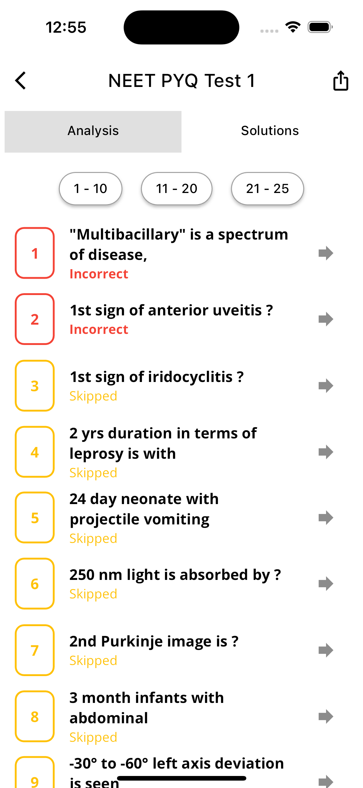
  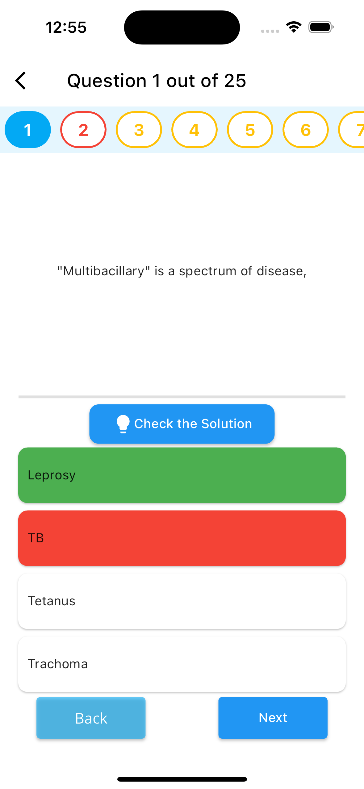
  
  
  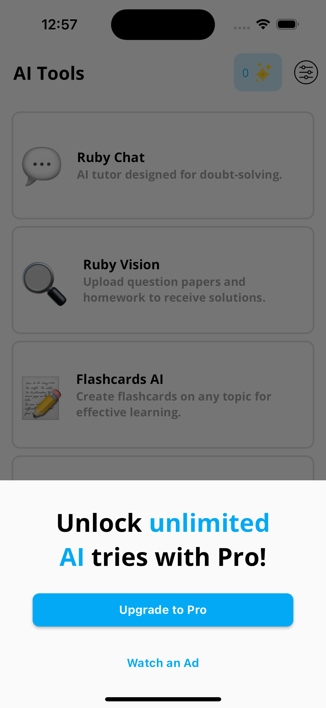
  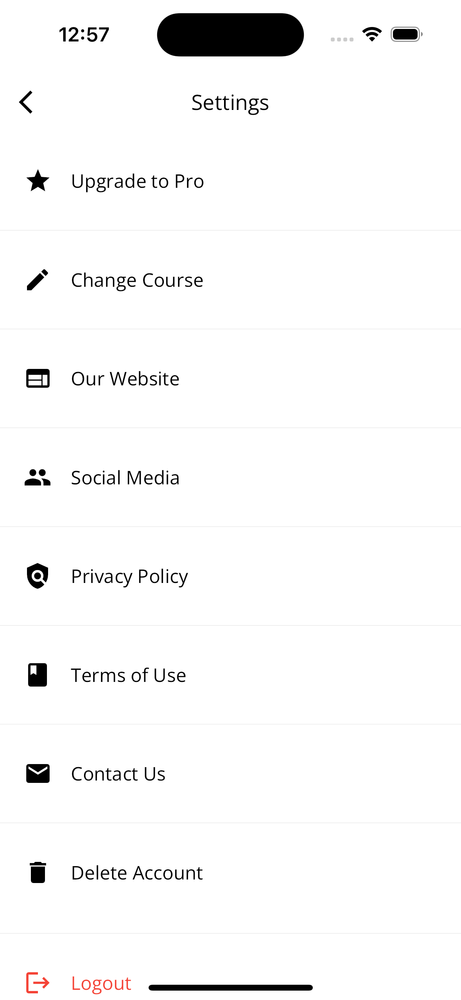

---

### Doubt Clear AI  
**[Doubt Clear AI](https://www.doubtclear.ai/)**

**Overview:**  
An AI-powered learning assistant designed to help students solve doubts instantly, 24/7.

**Key Features:**
- **Subject Coverage:** Includes Math, Science, Languages, and more.
- **Snap & Solve:** Scan questions from books and get instant answers.
- **Multilingual Support:** Makes learning easier for everyone, in any language.
- **Expert-Level Guidance:** AI provides detailed and accurate explanations.
- **Performance Boost:** Helps students perform better in exams.

**Screenshots:**  

  
  
  
  
  
  
  
  

---

### ScriptBae  
**[ScriptBae](http://www.visionarchitech.com)**

**Overview:**  
ScriptBae helps content creators craft impactful scripts for all types of media using advanced AI writing tools.

**Key Features:**
- **Diverse Genres:** Supports everything from TV shows to e-learning content.
- **Smart Suggestions:** AI guides plot development and dialogue creation.
- **Intuitive UX:** Clean UI that encourages creativity and ease of use.
- **Collaborative Tools:** Share scripts with teams for real-time feedback.
- **Boosted Creativity:** Offers tools to accelerate idea generation.

**Screenshots:**  

  
  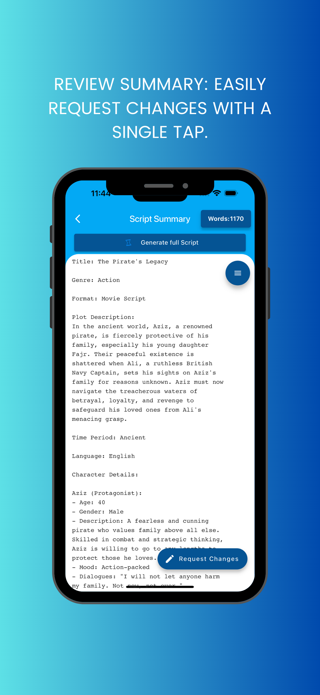
  
  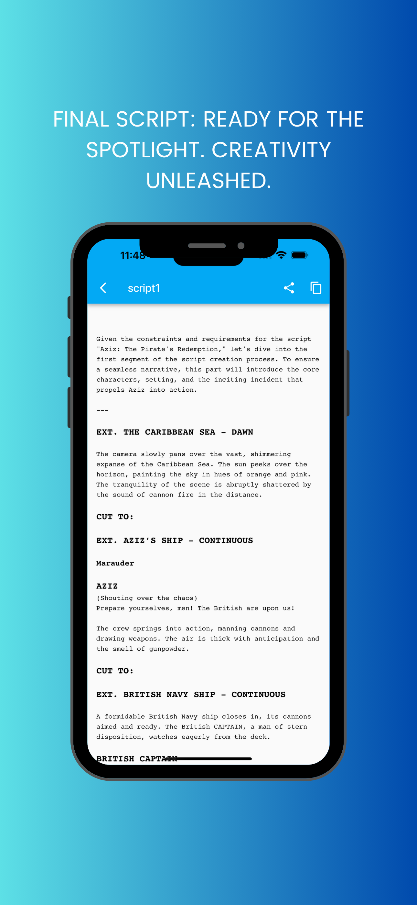
  
  
  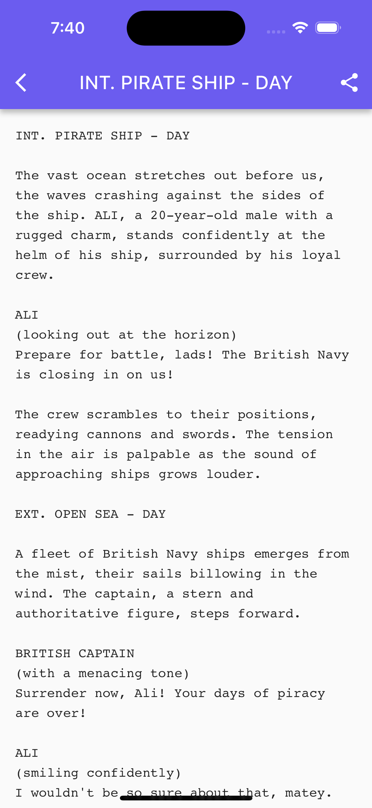
  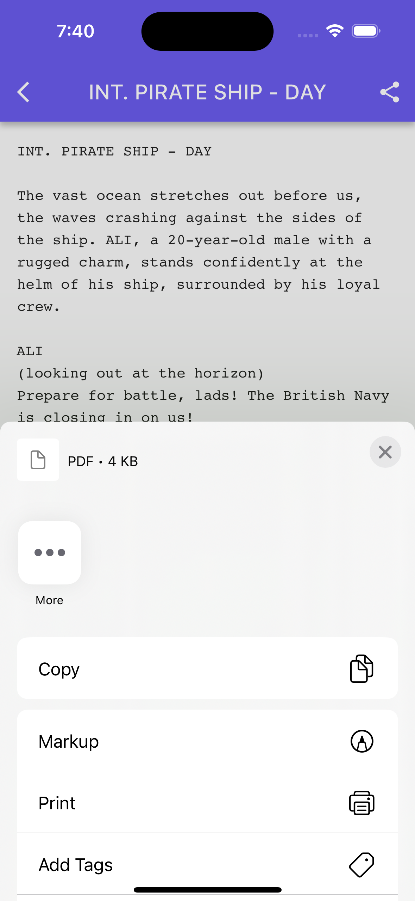
  

---

### RemoteTal  
**[RemoteTal](http://www.itechgemini.com)**

**Overview:**  
RemoteTal connects top global talent with companies seeking remote professionals.

**Key Features:**
- **International Hiring:** Access a wide range of verified professionals.
- **Streamlined Workflow:** Simplified recruitment and interview process.
- **Budget-Friendly:** Hire experts at optimized costs.
- **Secure Payments:** Trusted and protected transaction system.
- **App Store Optimization:** Better discoverability for your job postings.

**Screenshots:**  
  
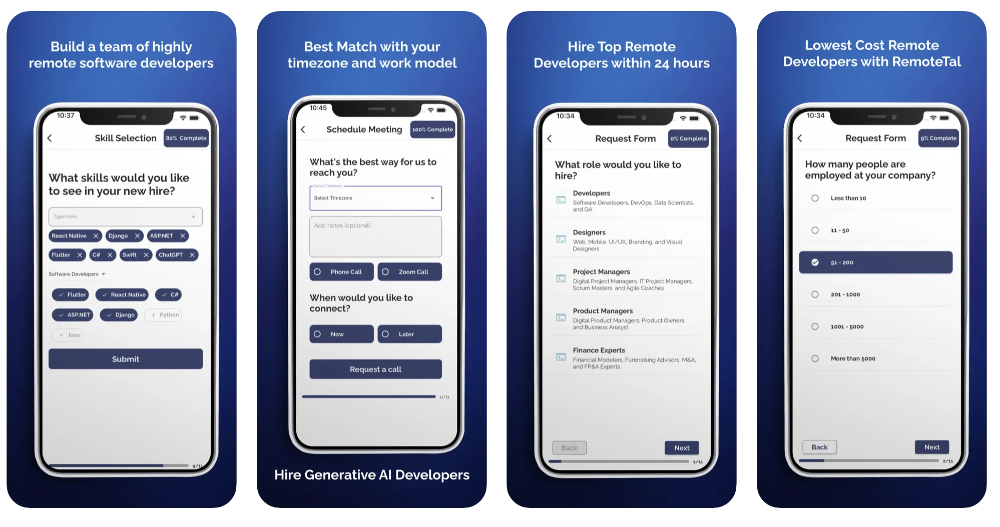

---

### CodeAI  
**[CodeAI](http://www.itechgemini.com)**

**Overview:**  
CodeAI acts as your virtual coding assistant—ideal for learners and developers alike.

**Key Features:**
- **Smart AI Assistant:** Answers all your programming questions.
- **Code Generation:** Turn natural language into actual code.
- **Debugging Tools:** Identify and fix bugs quickly.
- **Learning Support:** Deep knowledge base with examples and tips.
- **Developer Friendly:** Suits both beginners and pros.

**Screenshots:**  
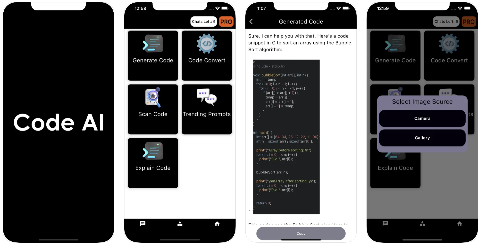  
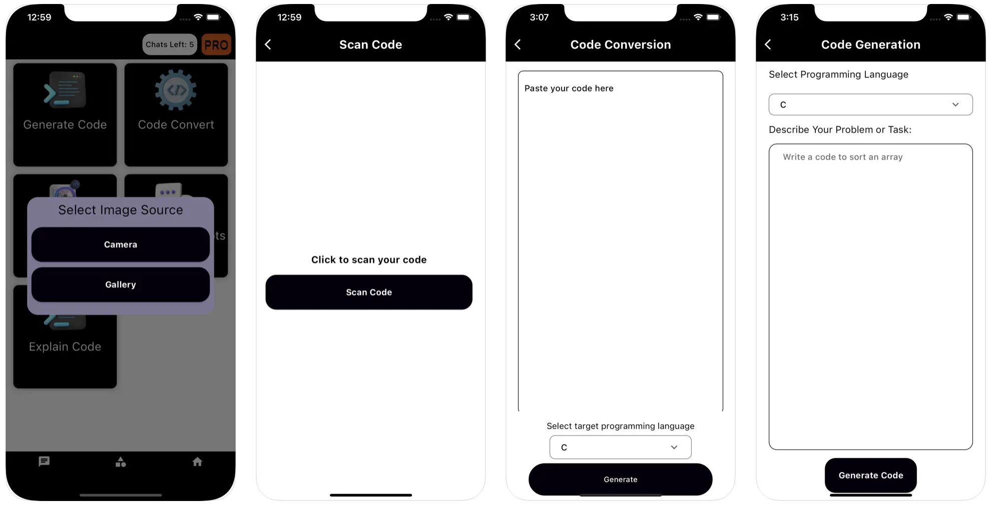

---

### PizzaGPT  
**[PizzaGPT](http://www.itechgemini.com)**

**Overview:**  
PizzaGPT is a multi-purpose AI chatbot that gives smart recommendations and assistance on the go.

**Key Features:**
- **Personalized Help:** From travel advice to product suggestions.
- **AI Chat:** Real-time conversations tailored to your needs.
- **Always Available:** Get help anytime, anywhere—free of cost.

**Screenshots:**  
  

---

### Speech AI  
**[Speech AI](http://www.itechgemini.com)**

**Overview:**  
Speech AI enhances communication, supports language learning, and offers on-demand knowledge with natural voice interaction.

**Key Features:**
- **Ask Anything:** Get instant answers using AI.
- **Speech Guidance:** AI-crafted help for speeches and presentations.
- **Multilingual:** Communicate in any language with ease.
- **AI Search Engine:** Access reliable information in seconds.
- **Chat Companion:** Friendly AI chat for casual and learning use.

**Screenshots:**  
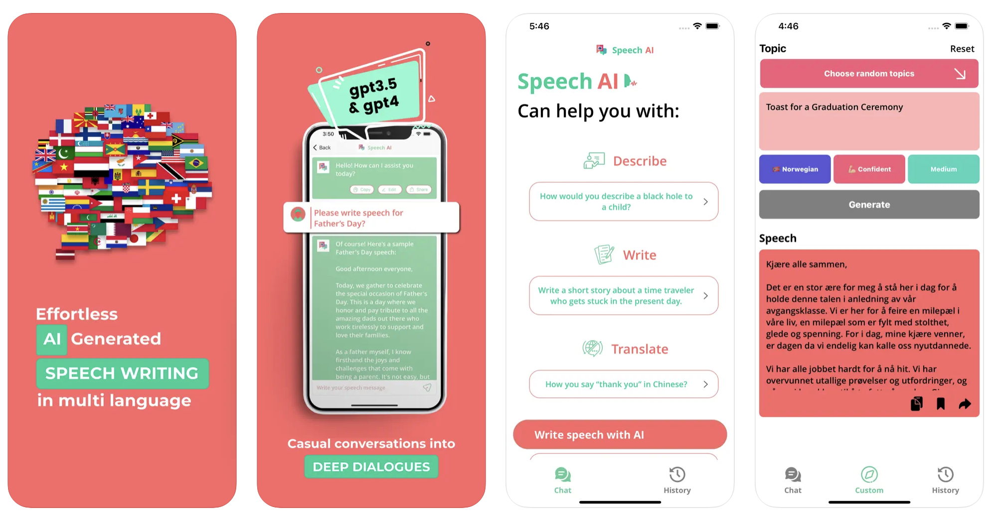  
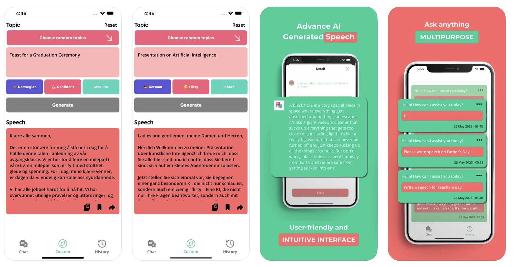

---

## 💬 Final Words

Every project in this portfolio is a result of careful planning, clean coding, and a deep understanding of what users need. Whether it's education, productivity, or automation—my goal is to build mobile apps that solve real problems with elegance.

Looking forward to collaborating with you!

